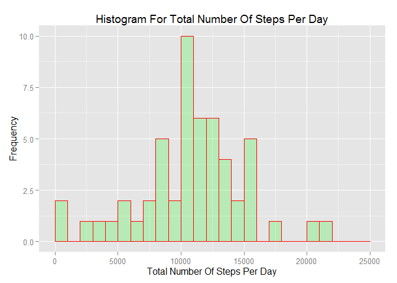
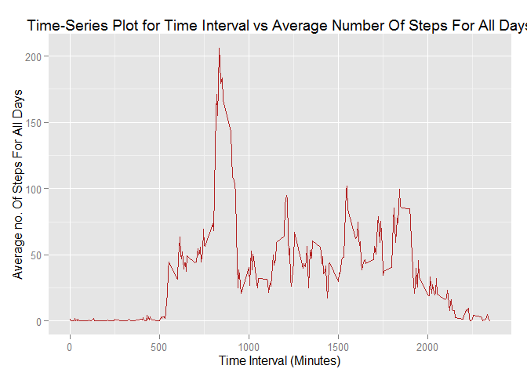
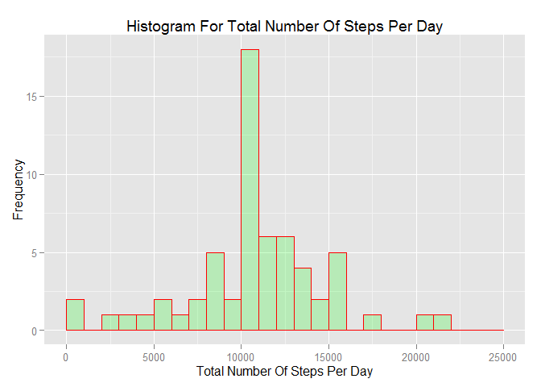
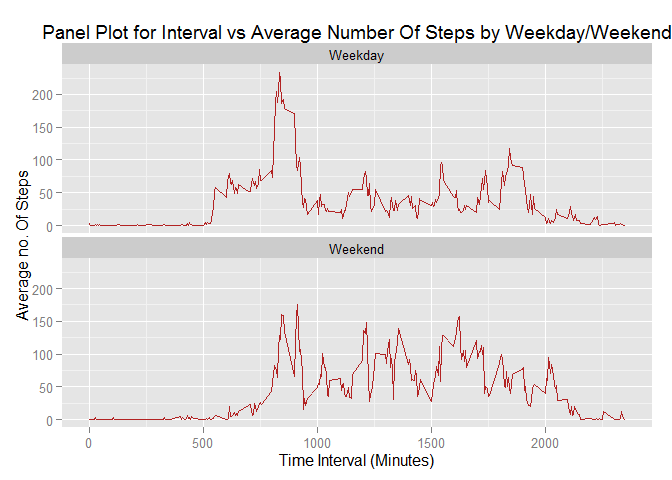

# Reproducible Research: Peer Assessment 1

#### Introduction

Personal activity monitoring devices like FitBit, Nike Fuel Band, Jawbone up etc. help in activity monitoring. Using one of such devices, which collect data at every 5 minute interval, we are required to perform analysis to address some of the questions listed below. For this analysis we use data over the period of two months (Oct, Nov - 2012).

####  Loading and preprocessing the data
* Read and load the data

```r
# load needed libraries
library(dplyr)
library(sqldf)
library(lubridate)
library(ggplot2)

# Download source data and unzip
#fileurl<-"https://d396qusza40orc.cloudfront.net/repdata%2Fdata%2Factivity.zip"
#download.file(fileurl,destfile = "./Activity.zip")
#datedownloaded<-date()
#datedownloaded

# using the file given in the Git repository
unzip("Activity.zip")


# read.csv() to load the source data into R, and some basic checks
activity<-read.csv(file = "activity.csv",sep = ",",header = TRUE, stringsAsFactors = FALSE)
```

* Unitesting the loaded data


```r
# check few rows of data
head(activity)
```

```
##   steps       date interval
## 1    NA 2012-10-01        0
## 2    NA 2012-10-01        5
## 3    NA 2012-10-01       10
## 4    NA 2012-10-01       15
## 5    NA 2012-10-01       20
## 6    NA 2012-10-01       25
```

```r
# see the data attributes
str(activity)
```

```
## 'data.frame':	17568 obs. of  3 variables:
##  $ steps   : int  NA NA NA NA NA NA NA NA NA NA ...
##  $ date    : chr  "2012-10-01" "2012-10-01" "2012-10-01" "2012-10-01" ...
##  $ interval: int  0 5 10 15 20 25 30 35 40 45 ...
```

```r
# Testing number of rows per each day 
head(sqldf('select activity.date, count(*) from
      activity group by activity.date'))
```

```
## Loading required package: tcltk
```

```
##         date count(*)
## 1 2012-10-01      288
## 2 2012-10-02      288
## 3 2012-10-03      288
## 4 2012-10-04      288
## 5 2012-10-05      288
## 6 2012-10-06      288
```

* Change date from CHAR to DATE using lubridate


```r
# change date from char to date
activity$date<-ymd(activity$date)

# check if date was converted
str(activity)
```

```
## 'data.frame':	17568 obs. of  3 variables:
##  $ steps   : int  NA NA NA NA NA NA NA NA NA NA ...
##  $ date    : POSIXct, format: "2012-10-01" "2012-10-01" ...
##  $ interval: int  0 5 10 15 20 25 30 35 40 45 ...
```

## What is mean total number of steps taken per day?

* Calculate total number of steps per day


```r
# Using DPLYR group data based on date column and sum by each date value
activity_group<-group_by(.data = activity,date)
activity_summary<-summarise_each(activity_group,funs=funs(...=sum))
```

* Histogram on total number of steps per day vs. Frequency


```r
# histogram for total steps per day vs frequency
ggplot(data = activity_summary,aes(activity_summary$steps))+
    geom_histogram(breaks=seq(0,25000, by = 1000),col="red",fill="green",alpha=.2)+
    labs(title="Histogram For Total Number Of Steps Per Day",x="Total Number Of Steps Per Day",y="Frequency")
```

 

* Mean/Median on total number of steps per day


```r
# provide mean and median for total number of steps per day
summary(activity_summary$steps)
```

```
##    Min. 1st Qu.  Median    Mean 3rd Qu.    Max.    NA's 
##      41    8841   10760   10770   13290   21190       8
```

## What is the average daily activity pattern?

* Calculate average number of steps group by interval 


```r
activity_interval<-arrange(.data = activity,interval)
activity_interval_group<-group_by(.data = activity_interval,interval)
activity_interval_summary<-summarise_each(activity_interval_group,funs = funs(... = mean(steps,na.rm = TRUE)))
```

* Time-Series plot for Time-Interval vs. average number of steps 


```r
ggplot(data = activity_interval_summary, aes(interval,steps))+geom_line(col="firebrick")+
    labs(title="Time-Series Plot for Time Interval vs Average Number Of Steps For All Days",x="Time Interval (Minutes)",y="Average no. Of Steps For All Days")
```

 

* Which 5-min Interval has max number of steps


```r
# which time iterval has max no of steps
activity_interval_summary[
    which(activity_interval_summary$steps == max(activity_interval_summary$steps)),"interval"]
```

```
## Source: local data frame [1 x 1]
## 
##   interval
## 1      835
```


## Inputing missing values

* Report total number of NA's in the data


```r
# number of rows with NA values
sum(is.na(activity$steps))
```

```
## [1] 2304
```

* Replace NA's with mean of steps for that particualar interval


```r
# loop through interval_summary which has mean by interval and for each interval 
# in the actual data replace with the rounded mean value

for(i in 1:nrow(activity_interval_summary)){
    interval_val<-activity_interval_summary[i,"interval"]
    activity_interval[which(activity_interval$interval == interval_val$interval & is.na(activity_interval$steps)),"steps"]<-round(activity_interval_summary[i,"steps"])
}
```

* Create a new DF with replaced NA's and sum steps by date


```r
## create a new data-frame and sum the steps by date
activity_without_na<-arrange(.data = activity_interval,date)
activity_without_na_group<-group_by(.data = activity_without_na,date)
activity_without_na_summary<-summarise_each(activity_without_na_group,funs=funs(...=sum))
```

* Histogram on total number of steps per day vs. Frequency 


```r
## histogram for total number of steps per date
ggplot(data = activity_without_na_summary,aes(activity_without_na_summary$steps))+
    geom_histogram(breaks=seq(0,25000, by = 1000),col="red",fill="green",alpha=.2)+
    labs(title="Histogram For Total Number Of Steps Per Day",x="Total Number Of Steps Per Day",y="Frequency")
```

 

```r
# provide mean and median after replacing NA's
summary(activity_without_na_summary$steps)
```

```
##    Min. 1st Qu.  Median    Mean 3rd Qu.    Max. 
##      41    9819   10760   10770   12810   21190
```

* Comparing Mean/Median values between data which has NA's and without NA's there isn't much difference in the values.But looking at the histogram there seems to be shift in frequency curve mostly moving a little higher on replacing NA's


## Are there differences in activity patterns between weekdays and weekends?

* Calculate weekday and then change it to Weekend or Weekday factors


```r
## calculate wday value and change it to weekday or weekend

activity$weekday<-wday(activity$date,label = TRUE)
activity$weekday<-as.character(activity$weekday)
activity$weekday[which(activity$weekday == "Sun" | activity$weekday == "Sat")]<-"Weekend"
activity$weekday[which(activity$weekday != "Weekend") ]<-"Weekday"
activity$weekday<-as.factor(activity$weekday)
```

* Remove NA's from this dataset and summarise by interval and weekday factors


```r
activity_interval<-arrange(.data = activity,interval)
activity_interval_group<-group_by(.data = activity_interval,interval)
activity_interval_summary<-summarise_each(activity_interval_group,funs = funs(... = mean(steps,na.rm = TRUE)))

for(i in 1:nrow(activity_interval_summary)){
    interval_val<-activity_interval_summary[i,"interval"]
    activity_interval[which(activity_interval$interval == interval_val$interval & is.na(activity_interval$steps)),"steps"]<-round(activity_interval_summary[i,"steps"])
}

## using DPLYR aggregare against interval and weekday
activity_interval<-arrange(.data = activity,interval,weekday)
activity_interval_group<-group_by(.data = activity_interval,interval,weekday)
activity_interval_summary<-summarise_each(activity_interval_group,funs = funs(... = mean(steps,na.rm = TRUE)))
```

* Panel plot comparing Weekday and Weekend activity


```r
# calculate panel-plot group by interval and weekday after the NA's are removed
### question4 panel-plot

ggplot(data = activity_interval_summary, aes(interval,steps))+geom_line(col="firebrick")+facet_wrap(~weekday,nrow = 2)+
    labs(title="Panel Plot for Interval vs Average Number Of Steps by Weekday/Weekend",x="Time Interval (Minutes)",y="Average no. Of Steps")
```

 
